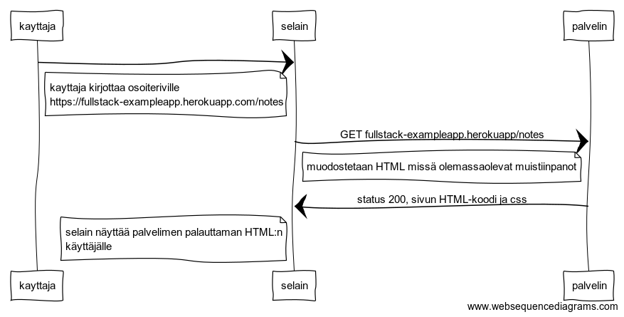

```
kayttaja->selain:
note left of selain
kayttaja kirjottaa osoiteriville
https://fullstack-exampleapp.herokuapp.com/notes
end note
selain->palvelin: GET fullstack-exampleapp.herokuapp/notes
note left of palvelin
  muodostetaan HTML missä olemassaolevat muistiinpanot
end note
palvelin->selain: status 200, sivun HTML-koodi ja css

note left of selain
 selain näyttää palvelimen palauttaman HTML:n
 käyttäjälle
end note
```
