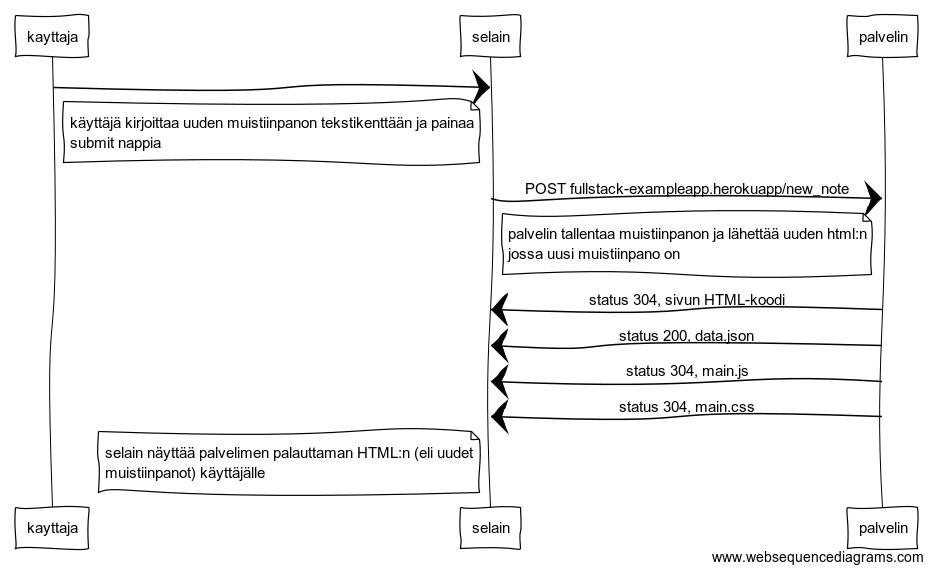

```
kayttaja->selain:
note left of selain
käyttäjä kirjoittaa uuden muistiinpanon tekstikenttään ja painaa
submit nappia
end note
selain->palvelin: POST fullstack-exampleapp.herokuapp/new_note
note left of palvelin
  palvelin tallentaa muistiinpanon ja lähettää uuden html:n
  jossa uusi muistiinpano on
end note
palvelin->selain: status 304, sivun HTML-koodi
palvelin->selain: status 200, data.json
palvelin->selain: status 304, main.js
palvelin->selain: status 304, main.css

note left of selain
 selain näyttää palvelimen palauttaman HTML:n (eli uudet
 muistiinpanot) käyttäjälle
end note
```
