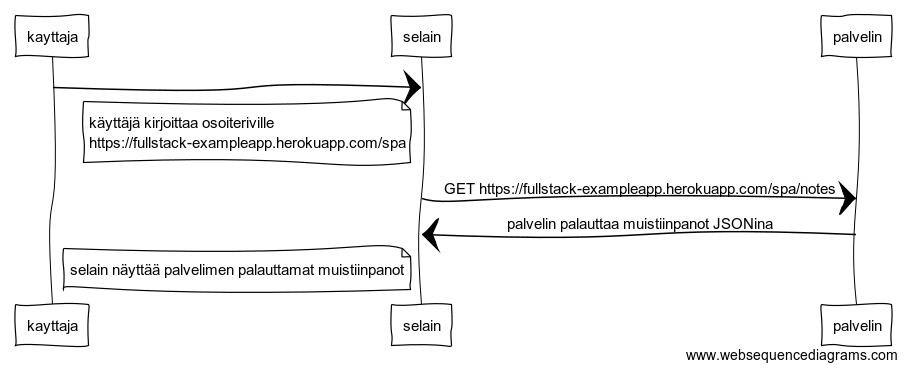

```
kayttaja->selain:
note left of selain
käyttäjä kirjoittaa osoiteriville
https://fullstack-exampleapp.herokuapp.com/spa
end note
selain->palvelin: GET https://fullstack-exampleapp.herokuapp.com/spa/notes

palvelin->selain: palvelin palauttaa muistiinpanot JSONina

note left of selain
 selain näyttää palvelimen palauttamat muistiinpanot
end note
```
