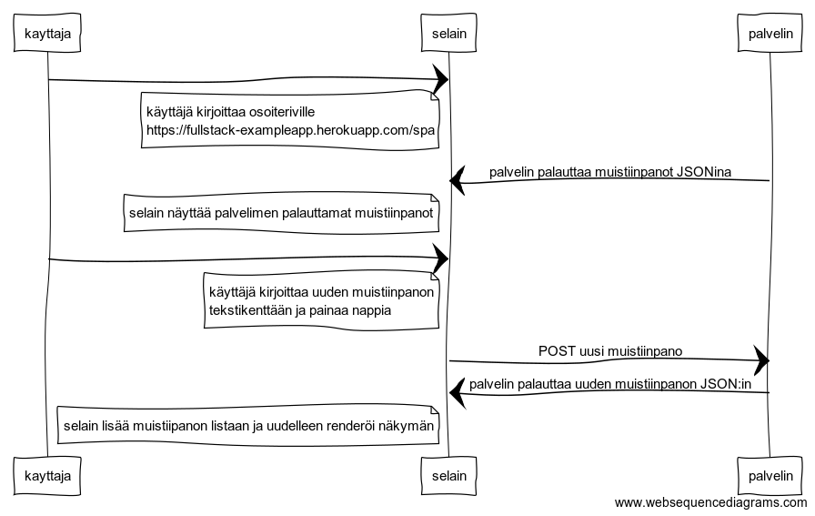

```
kayttaja->selain:
note left of selain
käyttäjä kirjoittaa osoiteriville
https://fullstack-exampleapp.herokuapp.com/spa
end note

palvelin->selain: palvelin palauttaa muistiinpanot JSONina

note left of selain
 selain näyttää palvelimen palauttamat muistiinpanot
end note

kayttaja->selain:
note left of selain
käyttäjä kirjoittaa uuden muistiinpanon 
tekstikenttään ja painaa nappia
end note

selain->palvelin: POST uusi muistiinpano
palvelin->selain: palvelin palauttaa uuden muistiinpanon JSON:in

note left of selain
selain lisää muistiipanon listaan ja uudelleen renderöi näkymän
end note
```
